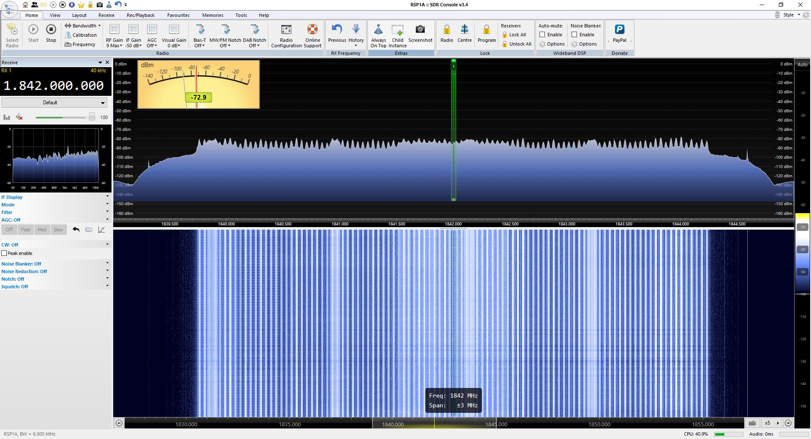

# LibreSDR Firmware with Timestamp Support for LTE

High-performance LibreSDR firmware with Phil Greenland's sample-accurate timestamp support, enabling LTE base station operation with srsRAN. Two optimized variants available for different hardware configurations.


*5 MHz LTE signal at 1842 MHz (Band 4) as seen in SDR Console*

## 🚀 Quick Start

**Download prebuilt firmware:**
- [v0.37 Release](https://github.com/pumatrax/libresdr-fw-timestamps/releases/tag/v0.37-timestamps) - Stable CMOS variant
- [v0.38 Release](https://github.com/pumatrax/libresdr-fw-timestamps/releases/tag/v0.38-timestamps) - Overclocked LVDS variant

**Flash via DFU:**
```bash
sudo dfu-util -a firmware.dfu -D libre.dfu
```

**Configure for LTE:**
```bash
fw_setenv compatible ad9361
fw_setenv mode 2r2t
reboot
```

Done! Your LibreSDR is ready for srsRAN.

---

## 📦 Two Variants - Pick Your Performance Level

### v0.37 - Rock Solid Stability (0wl CMOS base)
**Branch:** `libre-timestamps-working`

The reliable workhorse. Based on 0wl's original LibreSDR port with CMOS interface.

**Specs:**
- CMOS AD9361 interface
- Standard Zynq clocking
- Proven stable at PRB 25 (5 MHz LTE)
- Best for: First-time LTE builders, maximum compatibility

**Build from source:**
```bash
git clone --recursive https://github.com/pumatrax/libresdr-fw-timestamps.git
cd libresdr-fw-timestamps
git checkout libre-timestamps-working
./setup_uboot_config.sh  # Important! Sets up u-boot config
export VIVADO_SETTINGS=/opt/Xilinx/Vivado/2021.2/settings64.sh
export TARGET=libre
make
```

---

### v0.38 - Maximum Performance (hz12 LVDS base)
**Branch:** `libre-v0.38-timestamps`

The speed demon. Hz12's optimized build with LVDS and aggressive overclocking.

**Specs:**
- LVDS AD9361 interface
- CPU: 750 MHz (12% faster)
- DDR: 525 MHz standard / 750 MHz overclocked
- Hz12's high-sample-rate optimizations
- Proven stable at PRB 25 (5 MHz LTE)
- Best for: Maximum performance, users comfortable with overclocking

**Available builds:**
- **525 MHz DDR** - Conservative, proven stable
- **750 MHz DDR** - Maximum performance, tested stable

**Build from source:**
```bash
git clone --recursive https://github.com/pumatrax/libresdr-fw-timestamps.git
cd libresdr-fw-timestamps
git checkout libre-v0.38-timestamps
export VIVADO_SETTINGS=/opt/Xilinx/Vivado/2022.2/settings64.sh
export TARGET=libre
make
```

**Note:** v0.38 requires Vivado 2022.2 (v0.37 uses 2021.2)

---

## 🎯 What Makes This Special?

### Sample-Accurate Timestamps
Phil Greenland's timestamp system provides microsecond-accurate sample timing essential for LTE synchronization. Without this, phones won't decode MIB and can't connect.

**How it works:**
- Hardware timestamp counter in FPGA (64-bit, CE-gated)
- UDP transport over Gigabit Ethernet (ports 30432/30433)
- `sdr_ip_gadget` daemon handles timestamp insertion
- SoapySDR driver extracts timestamps for srsRAN

### The v0.38 Clock Domain Challenge (And How We Solved It)

Hz12's v0.38 uses `axi_ad9361/l_clk` for DMA clocks to achieve extreme sample rates (27.5 MSPS). However, Phil's timestamp logic couldn't meet timing constraints in this faster clock domain - Vivado failed with **WNS=-3.262ns**.

**Solution:** Reverted four critical DMA clocks back to `sys_cpu_clk`:
- `axi_ad9361_adc_dma/fifo_wr_clk`
- `axi_ad9361_dac_dma/m_axis_aclk`
- `cpack_timestamp/dma_clk`
- `upack_timestamp/dma_clk`

**Result:** Clean timing closure (**WNS=+0.715ns**) while keeping hz12's CPU/DDR overclocking and LVDS optimizations. Trade-off: Lose extreme sample rates (>20 MSPS) but maintain everything needed for LTE (≤15.36 MSPS at PRB 50).

---

## 📊 Tested Performance

Both variants tested with srsRAN_4G on Linux host, LTE Band 4:

| PRB | Bandwidth | v0.37 Status | v0.38 Status | Notes |
|-----|-----------|--------------|--------------|-------|
| 6   | 1.4 MHz   | ✅ Stable    | ✅ Stable    | Entry level |
| 15  | 3 MHz     | ✅ Stable    | ✅ Stable    | Recommended starting point |
| 25  | 5 MHz     | ✅ Stable    | ✅ Stable    | **Sweet spot** - phones connect to auth |
| 50  | 10 MHz    | ❌ Clock limit | ❌ Clock limit | AD9361 constraint |

**Authentication reached:** Phones successfully attach and begin authentication at PRB 25 on both variants. MAC code.

---

## ⚙️ Configuration & Optimization

### Required Firmware Settings
```bash
fw_setenv compatible ad9361
fw_setenv mode 2r2t
reboot
```

### Post-Boot Optimization (Optional but Recommended)
```bash
# Increase network buffers
sysctl -w net.core.rmem_max=16777216
sysctl -w net.core.wmem_max=16777216
sysctl -w net.core.rmem_default=16777216
sysctl -w net.core.wmem_default=16777216

# Increase IIO buffers
echo 32768 > /sys/bus/iio/devices/iio:device3/buffer/length
echo 32768 > /sys/bus/iio/devices/iio:device2/buffer/length

# Boost daemon priority
renice -20 $(pidof sdr_ip_gadget)

# Optional: Kill unused services
killall httpd
/etc/init.d/S46iiod stop
```

### srsRAN Configuration

**For PRB 25 (5 MHz):**
```ini
[enb]
n_prb = 25

[rf]
device_name = soapy
device_args = driver=plutosdr,hostname=192.168.1.1,direct=1,timestamp_every=5760,loopback=0
tx_gain = 89
rx_gain = 20
```

**Critical:** Use `timestamp_every=5760` for PRB 25 (not the standard 7680).

**Timestamp values for other PRBs:**
- PRB 6: `timestamp_every=1920`
- PRB 15: `timestamp_every=3840`
- PRB 25: `timestamp_every=5760`

---

## 🔌 Hardware Requirements

### Essential
- LibreSDR with Gigabit Ethernet
- Zynq-7020 SoC / AD9361 transceiver
- **Quality 5V 3A power supply** (critical for overclocked builds!)

### Power Supply Matters!
Insufficient power causes:
- Clock instability
- DDR errors  
- RF chain failures
- Random crashes

**Use:**
- Dedicated USB port on PC (not a hub)
- Quality 5V 3A adapter with clean regulation
- Short, thick USB cable

Cheap power strips with shared USB ports **will cause problems** with overclocked builds.

---

## 🔧 Build Requirements

### v0.37 Build Environment
- Ubuntu 20.04 LTS (or compatible)
- Vivado/Vitis 2021.2
- Cross-compiler: `arm-linux-gnueabihf-gcc`

### v0.38 Build Environment  
- Ubuntu 20.04 LTS (or compatible)
- Vivado/Vitis 2022.2
- Cross-compiler: `arm-linux-gnueabihf-gcc`

**Install dependencies:**
```bash
sudo apt-get install git build-essential fakeroot libncurses5-dev libssl-dev ccache
sudo apt-get install dfu-util u-boot-tools device-tree-compiler mtools bc python cpio
sudo apt-get install zip unzip rsync file wget
```

---

## 🐛 Troubleshooting

### "No TX buffer" or daemon not starting
```bash
/etc/init.d/S55sdr_ip_gadget stop
echo 0 > /sys/bus/iio/devices/iio:device2/buffer/enable
echo 0 > /sys/bus/iio/devices/iio:device3/buffer/enable
/etc/init.d/S55sdr_ip_gadget start
```

### Phones detect signal but won't connect
- Verify `fw_setenv mode 2r2t` is set
- Check `timestamp_every` matches your PRB setting
- Reboot Linux host (stale network state)

### "ADC clock below limit" errors
This is normal at PRB 50 - it's an AD9361 limitation with the current clock configuration. PRB 25 is the maximum supported bandwidth.

### Build fails on v0.37 with "Can't find zynq_libre_defconfig"
```bash
./setup_uboot_config.sh
```

---

## 🙏 Credits & Acknowledgments

This work stands on the shoulders of giants:

**Phil Greenland** ([@pgreenland](https://github.com/pgreenland))
- Timestamp implementation and LTE guides
- Sample-accurate timing architecture
- Patient troubleshooting support

**hz12** ([@hz12opensource](https://github.com/hz12opensource))
- v0.38 LibreSDR optimizations and overclocking
- LVDS performance improvements
- Extensive stability testing

**0wl** ([@day0wl](https://github.com/day0wl))
- Original LibreSDR hardware port from PlutoSDR
- v0.37 base firmware

**Analog Devices**
- PlutoSDR HDL framework
- AD9361 driver and documentation

---

## 📖 Additional Resources

**Phil's LTE Guides:**
- [Private LTE with Pluto+ SDR](https://www.quantulum.co.uk/blog/private-lte-with-plutoplus-sdr/)
- Phil's timestamp repositories (see Credits)

**srsRAN Documentation:**
- [srsRAN 4G](https://docs.srsran.com/projects/4g/)
- [eNodeB Configuration](https://docs.srsran.com/projects/4g/en/latest/app_notes/source/srsenb/source/index.html)

**LibreSDR Hardware:**
- [Hz12's LibreSDR Repository](https://github.com/hz12opensource/libresdr)
- [0wl's LibreSDR Port](https://github.com/day0wl/libresdr-fw)

---

## 📝 License

This project inherits licenses from its upstream components:
- PlutoSDR firmware components: See individual submodule licenses
- Timestamp additions by Phil Greenland: Check Phil's repositories
- LibreSDR modifications: GPL where applicable

---

## 🤝 Contributing

Found a bug? Have an improvement? PRs welcome!

**Particularly interested in:**
- Clock domain optimization for timestamps in l_clk domain
- PRB 50 support investigations
- Power consumption optimizations
- Additional LTE band testing

---

## ⚠️ Legal Notice

This firmware is for **amateur radio experimentation and research only**. Operating LTE base stations requires appropriate licenses and regulatory compliance in most jurisdictions. Consult your local regulations before transmitting.

---

**Built with curiosity, debugged with persistence, powered by open source.**
